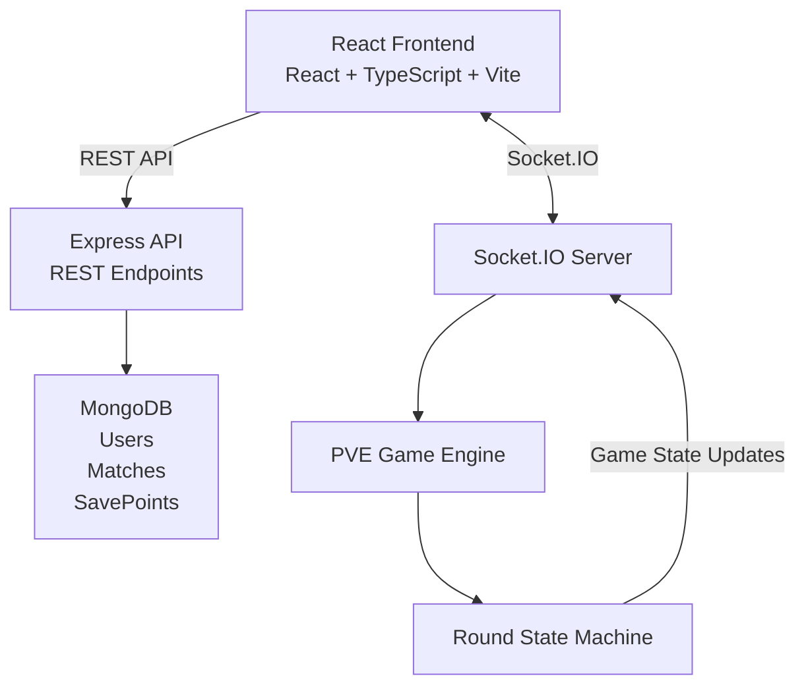
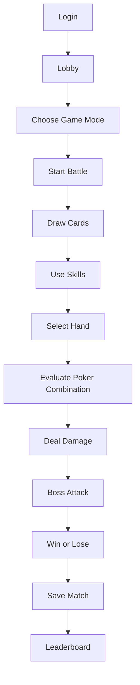
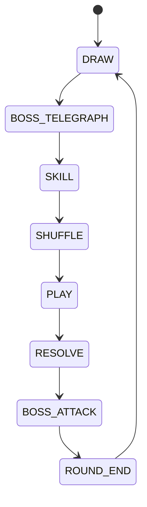
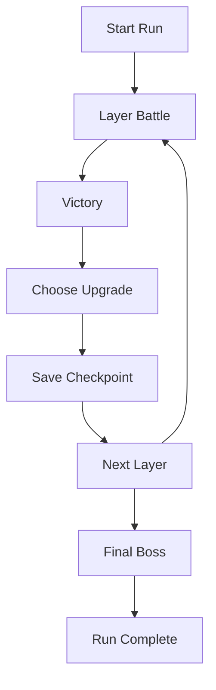

# Card Rogue

A full-stack, browser-based PVE card battler built around poker hand mechanics. Players select cards to form poker combinations, deal damage to bosses across layered floors, use tactical skills, and track results on a seasonal leaderboard. The project is an npm workspaces monorepo with a React SPA frontend and an Express + Socket.IO backend.

---

## Live Demo

| | URL |
|---|-----|
| **Frontend** | [https://card-rogue.onrender.com](https://card-rogue.onrender.com) |

> The application is hosted on Render. Initial startup may take 30–60 seconds if the service is idle.

---

## Demo Account

Use this account to explore the app without registering:

| Field | Value |
|-------|-------|
| **Username** | `TestUser` |
| **Email** | `demo@cardrogue.com` |
| **Password** | `Demo123!` |

---

## Screenshots

### Home Page


### Login Page


### Lobby


### Game Page


### Leaderboard


---

## System Architecture



**Design decisions**

- **Server-authoritative gameplay** — Card selection, skill usage, and phase transitions are validated on the backend; the client renders state and sends intent events.
- **In-memory game rooms** — Active PVE sessions live in a runtime map; outcomes are archived to MongoDB when a run ends.
- **Monorepo workspaces** — Shared tooling at the root; independent `frontend` and `backend` packages with separate build pipelines.
- **Dev proxy** — Vite forwards `/api`, `/uploads`, and `/socket.io` to the backend during local development.

---

## Gameplay Flow



---

## PVE Round State Machine



---

## Rogue Mode Progression



---

## Features

### Gameplay
- **Poker-hand combat** — Server-side hand evaluation drives damage, multipliers, and battle resolution
- **Round phase machine** — Draw → Boss telegraph → Skill → Shuffle → Play → Resolve → Boss attack → Round end
- **Active skills** — Shield, change color, and change rank with energy/cooldown constraints
- **Layered PVE** — Boss configs scale HP, attack, and intent weights per floor
- **Rogue mode** — Upgrade selection between layers, buff system, and REST-backed save/load checkpoints

### Platform
- **Authentication** — Email/password registration and login, plus Google OAuth (GIS)
- **User profiles** — Avatar upload, XP display, and aggregated match statistics
- **Lobby** — Mode selection (Solo / Rogue), recent match history, and season countdown
- **Leaderboard** — Paginated rankings by win rate and total wins with eligibility rules
- **Real-time sync** — Socket.IO rooms for live game state updates and player actions
- **Match archival** — Completed games persisted to MongoDB for history and stats

### Frontend UX
- Landing page with animated card showcase
- Login / register flows with carousel imagery
- Responsive layout tokens for 1024px–1920px+ viewports
- In-game audio (BGM + SFX) with user mute preference persisted in `localStorage`
- Page transitions and loading states across routes

---

## Tech Stack

| Layer | Technologies |
|-------|--------------|
| **Frontend** | React 19, TypeScript, Vite 8, React Router 7, Tailwind CSS 3, Axios |
| **Realtime** | Socket.IO Client 4 |
| **Backend** | Node.js, Express 4, TypeScript, Socket.IO 4 |
| **Database** | MongoDB, Mongoose 9 |
| **Auth** | JWT, bcrypt, Google Auth Library |
| **Tooling** | npm workspaces, ESLint, Playwright (dev scripts), PostCSS |

---

## Installation

### Prerequisites

- **Node.js** 18+
- **npm** 9+
- **MongoDB** instance (local or Atlas)

### Setup

```bash
# Clone the repository
git clone <repository-url>
cd CardGame

# Install dependencies (root workspace)
npm install

# Configure environment variables (see below)
cp backend/.env.example backend/.env
cp frontend/.env.example frontend/.env

# Start backend (default http://localhost:5000)
npm run dev:backend

# In a separate terminal, start frontend (default http://localhost:5173)
npm run dev:frontend
```

### Production build

```bash
npm run build              # builds frontend + backend
npm run start -w backend   # serves API after backend build
```

Serve the frontend `dist/` output with any static host. Point `VITE_*` variables at the deployed backend origin.

### Health check

```bash
curl http://localhost:5000/api/health
# { "status": "ok", "message": "Backend is running" }
```

> **Note:** `frontend/vite.config.ts` proxies to port `5001` by default. Either set `PORT=5001` in `backend/.env` or update the proxy target to match your backend port.

---

## Environment Variables

### Backend (`backend/.env`)

| Variable | Description |
|----------|-------------|
| `PORT` | HTTP server port (default `5000`) |
| `MONGODB_URI` | MongoDB connection string |
| `JWT_SECRET` | Secret for signing access tokens |
| `GOOGLE_CLIENT_ID` | Google OAuth client ID (server-side token verification) |
| `FRONTEND_URL` | Allowed frontend origin for CORS |

See `backend/.env.example` for a template.

### Frontend (`frontend/.env`)

| Variable | Description |
|----------|-------------|
| `VITE_API_BASE_URL` | REST API base URL (omit in local dev — uses Vite proxy `/api`) |
| `VITE_SOCKET_URL` | Socket.IO server URL (omit in local dev) |
| `VITE_API_ORIGIN` | Backend origin for avatar URLs |
| `VITE_GOOGLE_CLIENT_ID` | Google Identity Services client ID |

See `frontend/.env.example` for a template.

Do not commit `.env` files. Secrets belong in environment configuration only.

---

## Project Structure

```
CardGame/
├── frontend/                    # React SPA
│   ├── public/                  # Static assets (cards, audio, images, effects)
│   ├── src/
│   │   ├── api/                 # REST client modules
│   │   ├── components/
│   │   │   ├── auth/            # Google sign-in button
│   │   │   ├── common/          # Loading, avatar, page transition
│   │   │   ├── game/            # HandArea, SkillBar, ScorePanel, BossVideo…
│   │   │   └── layout/          # Navbar, RootLayout
│   │   ├── hooks/               # useGameAudio, etc.
│   │   ├── lib/                 # Hand layout, XP, card images, eval helpers
│   │   ├── pages/               # Home, Login, Register, Lobby, Game, Rogue, Leaderboard
│   │   ├── socket/              # Socket.IO client setup
│   │   ├── stores/              # AuthContext, auth storage
│   │   ├── styles/              # Page CSS, design tokens, responsive breakpoints
│   │   └── types/               # Shared TS interfaces
│   └── vite.config.ts
│
├── backend/                     # Express API + Socket.IO server
│   └── src/
│       ├── config/              # Database, CORS
│       ├── controllers/         # Auth, users, matches, leaderboard
│       ├── middleware/          # JWT auth, avatar upload
│       ├── models/              # User, Match, SavePoint
│       ├── pve/                 # Game engine (actions, boss, deck, handEvaluator, roundMachine)
│       ├── routes/              # REST route definitions
│       ├── services/            # Match archive, rogue save
│       ├── socket/              # Socket auth, PVE event handlers
│       ├── types/               # Cards, buffs, boss, game state, events
│       ├── utils/               # JWT, avatar files, username helpers
│       └── validators/          # Login/register input validation
│
├── package.json                 # Root workspace scripts
└── README.md
```

### Backend test suite

The backend includes unit and integration tests for the PVE engine:

```bash
npm run test:pve -w backend
```

Individual test targets (`test:handEvaluator`, `test:actions`, `test:roundLoop`, etc.) are defined in `backend/package.json`.

---

## My Contributions

Portfolio summary as a **Junior Frontend Developer** and **Full-stack contributor** on this project.

### Frontend (primary focus)
- **SPA architecture** — Built routed pages with React Router, protected routes, centralized `AuthContext`, and a typed REST API layer (`src/api/`).
- **Game UI** — Implemented the in-game interface: fanned hand layout (`handFanLayout`), `HandArea` / `HandCard` interaction, skill bar panels, score panel, boss video overlay, attack effects, and top-bar controls.
- **Responsive layout** — Added CSS custom properties and breakpoint tokens (`responsive-tokens.css`, `game.css`, `game-visual-ref.css`) to scale HUD chrome and card interactions across 1024px–1920px viewports.
- **Auth & onboarding UX** — Developed Home, Login, and Register pages with carousel imagery, form feedback, and Google OAuth (GIS) integration.
- **Lobby & leaderboard UI** — Recent match list, avatar upload, season countdown, table column alignment, and merged leaderboard dashboard layout.
- **Client-side audio** — `audioManager` + `useGameAudio` hook for BGM/SFX, browser unlock handling, and mute preference persistence.

### Full-stack
- **Real-time gameplay integration** — Connected the React client to Socket.IO PVE handlers; mapped server game state to UI components without duplicating game logic on the client.
- **Auth & session fixes** — Resolved production loading loops in `AuthContext` / `ProtectedRoute` that caused redundant `/api/users/me` requests and lobby remounts.
- **API collaboration** — Worked with REST endpoints (matches, leaderboard, rogue saves) and aligned frontend types with backend models.

---

## Future Improvements

- **Automated E2E coverage** — Expand Playwright scripts into a CI-friendly regression suite for auth, lobby, and core game flows.
- **Component-level tests** — Add Vitest + React Testing Library for hand layout, auth guards, and score panel logic.
- **Unified dev port config** — Align Vite proxy port with backend defaults to reduce local setup friction.
- **Accessibility pass** — Audit keyboard navigation, ARIA labels on game controls, and color contrast on HUD elements.
- **Performance** — Code-split game routes and lazy-load heavy assets (boss videos, card textures) on first entry.
- **Observability** — Structured logging and error boundaries with client-side reporting for production debugging.
- **Deployment tooling** — Docker Compose for local MongoDB + app stack; documented Render split deployment.
- **Gameplay extensions** — PVP rooms, spectator mode, additional boss mechanics, and mobile-first touch targets for hand selection.

---

## Scripts Reference

| Command | Description |
|---------|-------------|
| `npm run dev:frontend` | Start Vite dev server |
| `npm run dev:backend` | Start backend with hot reload (`tsx watch`) |
| `npm run build` | Production build (frontend + backend) |
| `npm run build:frontend` | Build frontend only |
| `npm run build:backend` | Compile backend TypeScript |
| `npm run start -w backend` | Run compiled backend |
| `npm run lint -w frontend` | ESLint on frontend |
| `npm run test:pve -w backend` | Run PVE engine test suite |

---

## License

Private project. All rights reserved unless otherwise specified by the repository owner.
