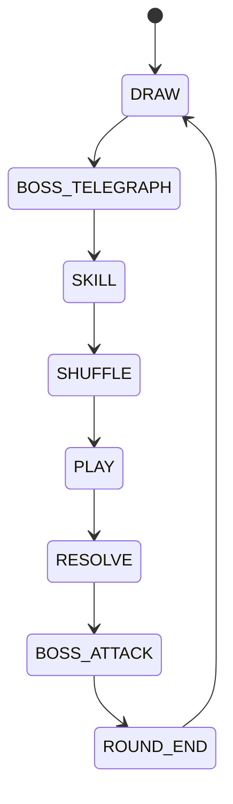
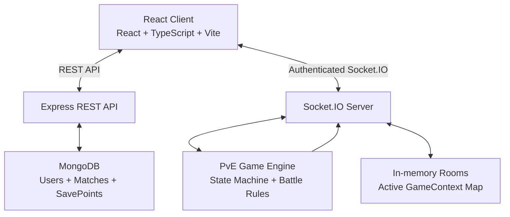

# Card Rogue

中文 | [English](./README_EN.md)

一款以扑克牌型为核心结算机制的全栈浏览器 PvE 卡牌战斗游戏。React 客户端负责交互与表现，Node.js 服务端作为对局状态权威，通过 Socket.IO 驱动实时战斗同步，并将账号、战绩与肉鸽存档持久化到 MongoDB。

## 在线演示

[https://card-rogue.onrender.com](https://card-rogue.onrender.com)

> 当前项目展示链接部署在 Render。服务闲置后首次访问可能需要 30–60 秒启动。

## 项目亮点

- **服务端权威对局**：客户端只发送选牌、出牌、技能等操作意图；服务端校验阶段与参数，计算结果后再同步完整游戏状态。
- **显式 PvE 状态机**：回合按抽牌、Boss 预告、技能、洗牌、出牌、结算、Boss 攻击、回合结束的阶段推进，避免客户端自行推演规则。
- **实时双向同步**：Socket.IO 连接受 JWT 认证保护；每位用户拥有独立游戏房间，服务端处理事件并返回 `gameState`、胜负或错误事件。
- **可持久化的游戏进度**：MongoDB 保存用户、已结束对局及肉鸽检查点；内存只承载当前活跃战斗房间。
- **完整的浏览器体验**：包含注册/登录、Google 登录、头像上传、大厅、最近战绩、排行榜、普通 PvE 与肉鸽模式，以及游戏内音效和响应式界面。

## 功能特性

- 基于扑克牌型的出牌与伤害结算，最多选择五张手牌。
- Boss 意图预告、攻击、蓄力与防御；不同层级的 Boss 配置会调整生命、攻击及意图权重。
- 护盾、变色、变点数三种技能，带有能量、冷却或目标校验。
- 普通 PvE 对局与肉鸽流程：层间强化选择、Buff 叠加、检查点保存与恢复。
- 邮箱密码注册/登录、Google Identity Services 登录、JWT Bearer 身份认证与受保护路由。
- 用户资料、头像上传、最近对局、胜率/胜场排行榜和 XP 展示。

## 游戏流程

玩家进入普通 PvE 或肉鸽对局后，服务端创建房间并初始化牌堆、手牌、Boss 与首回合意图。每回合的基本流程如下：

```text
抽牌 → Boss 意图预告 → 使用技能 → 可选洗牌 → 选择手牌 → 确认出牌
→ 计算牌型/伤害 → Boss 攻击 → 回合结束 → 下一回合
```

出牌结算由服务端根据牌型、卡牌分值、倍率、Buff 及 Boss 防御状态计算。普通 PvE 胜负会归档为对局历史；肉鸽模式通关当前层后进入强化选择，并在下一层开始前保存检查点。

### PvE 回合状态机


```mermaid
stateDiagram-v2
    [*] --> DRAW
    DRAW --> BOSS_TELEGRAPH
    BOSS_TELEGRAPH --> SKILL
    SKILL --> SHUFFLE
    SHUFFLE --> PLAY
    PLAY --> RESOLVE
    RESOLVE --> BOSS_ATTACK
    BOSS_ATTACK --> ROUND_END
    ROUND_END --> DRAW
```

## 系统架构


```mermaid
flowchart TB
    A["React Client<br/>React + TypeScript + Vite"]
    B["Express REST API"]
    C["Socket.IO Server"]
    D["PvE Game Engine<br/>State Machine + Battle Rules"]
    E["MongoDB<br/>Users + Matches + SavePoints"]
    F["In-memory Rooms<br/>Active GameContext Map"]

    A <-->|"REST API"| B
    A <-->|"Authenticated Socket.IO"| C
    B <--> E
    C <--> D
    C <--> F
    D --> C
```

项目当前**没有 Redis 依赖、连接配置或 Key 逻辑**。活跃对局使用服务端内存房间保存，MongoDB 负责跨会话数据持久化。

## 技术栈

| 分类 | 技术与职责 |
| --- | --- |
| Frontend | React 19、TypeScript、Vite、React Router、Axios、Tailwind CSS；负责页面、交互、REST 调用和 Socket 客户端。 |
| Backend | Node.js、Express 4、TypeScript；提供认证、用户、战绩、排行榜和肉鸽存档 REST API。 |
| Realtime | Socket.IO 4；处理已认证的 PvE 事件并向客户端同步服务端状态。 |
| Data | MongoDB、Mongoose；保存 User、Match、SavePoint 文档。活跃对局保存在内存中。 |
| Auth | JWT、bcrypt、Google Auth Library / Google Identity Services。 |
| Tooling | npm workspaces、ESLint、Playwright（截图/浏览器辅助脚本）、PostCSS。 |

## 核心技术实现

### 服务端权威状态与 Socket.IO

Socket 连接通过 JWT 中间件认证。服务器以用户 ID 生成 PvE 房间 ID，在内存中持有 `GameContext`；客户端的 `selectCard`、`confirmPlay`、`useSkill`、`enterShuffle` 等事件只表达操作意图。事件处理器检查房间、阶段和参数，更新上下文后发出 `gameState`，并在必要时发送 `battleWin`、`battleLose` 或 `gameError`。

### PvE 状态机、卡牌与战斗

`backend/src/pve/` 将牌堆、牌型识别、Boss 行为、伤害计算、回合状态和操作处理拆分。确认出牌后，服务端识别扑克牌型，叠加手牌分值、牌型倍率与 Buff，并处理 Boss 防御减伤；攻击动画完成事件才会触发 Boss 攻击结算和下一回合推进。

### MongoDB 持久化

已结束的普通 PvE 对局会写入 `Match`，并原子更新用户总局数、胜场、胜率和最高伤害。肉鸽模式使用 `SavePoint` 按用户保存当前快照，用于继续游戏、层间检查点恢复或主动放弃时删除。

### 身份认证

本地登录使用 bcrypt 校验密码，Google 登录由服务端校验 Google ID Token。两种登录方式都会签发有效期为 7 天的 JWT；受保护 REST 路由与 Socket 连接均从 Bearer Token 中恢复用户身份。

## 项目结构

```text
CardGame/
├── frontend/
│   ├── public/                 # 卡牌、音频、图片和视频等静态资源
│   ├── scripts/                # Playwright 截图与浏览器辅助脚本
│   └── src/
│       ├── api/                # REST 客户端模块
│       ├── components/         # 认证、通用、游戏、大厅和布局组件
│       ├── hooks/              # 自定义 Hook（如游戏音频）
│       ├── pages/              # 首页、认证、大厅、游戏、排行榜页面
│       ├── socket/             # Socket.IO 客户端创建
│       ├── stores/             # AuthContext 与本地认证状态
│       └── utils/              # 音频与展示工具
├── backend/
│   └── src/
│       ├── config/             # MongoDB 与 CORS 配置
│       ├── controllers/        # REST 控制器
│       ├── middleware/         # JWT、错误处理、头像上传
│       ├── models/             # User、Match、SavePoint Mongoose 模型
│       ├── pve/                # 状态机、牌堆、Boss、伤害和测试
│       ├── routes/             # REST 路由
│       ├── services/           # 战绩归档与肉鸽存档
│       ├── socket/             # Socket 认证与 PvE 事件处理器
│       └── types/              # 卡牌、Buff、Boss 和游戏状态类型
├── package.json                # npm workspaces 与根脚本
├── README.md                   # 中文说明（默认）
└── README_EN.md                # English documentation
```

## 本地运行

### 前置条件

- Node.js（建议使用当前 LTS 版本）
- npm
- 可访问的 MongoDB 实例（本地或 Atlas）

### 安装与配置

```bash
git clone <repository-url>
cd CardGame
npm install

cp backend/.env.example backend/.env
cp frontend/.env.example frontend/.env
```

填写 `backend/.env` 中的 MongoDB 与 JWT 配置。Google 登录为可选功能；如不配置对应 Client ID，Google 登录接口会返回未配置状态。

### 启动开发环境

`frontend/vite.config.ts` 的开发代理目标为 `http://localhost:5001`，而后端未设置 `PORT` 时默认监听 `5000`。本地使用默认代理时，请在 `backend/.env` 设置 `PORT=5001`：

```bash
# 终端 1
npm run dev:backend

# 终端 2
npm run dev:frontend
```

前端默认由 Vite 提供；后端健康检查为 `GET /api/health`。

### 生产构建与启动

```bash
npm run build
npm run start -w backend
```

根构建会依次执行前端 `tsc -b && vite build` 和后端 `tsc`。前端构建产物位于 `frontend/dist/`，需由静态服务器托管。

## 环境变量

### 后端：`backend/.env`

| 变量 | 用途 |
| --- | --- |
| `PORT` | HTTP 服务端口；未设置时后端默认使用 `5000`。 |
| `MONGODB_URI` | MongoDB 连接地址。 |
| `JWT_SECRET` | JWT 签发与校验密钥。 |
| `GOOGLE_CLIENT_ID` | 服务端验证 Google ID Token 使用的客户端 ID。 |
| `FRONTEND_URL` | CORS 允许的前端来源。 |

### 前端：`frontend/.env`

| 变量 | 用途 |
| --- | --- |
| `VITE_API_BASE_URL` | 生产环境 REST API 基础地址；本地可留空以使用 `/api` 代理。 |
| `VITE_SOCKET_URL` | 生产环境 Socket.IO 服务地址；本地可留空以使用同源代理。 |
| `VITE_API_ORIGIN` | 拼接上传头像 URL 时使用的后端来源。 |
| `VITE_GOOGLE_CLIENT_ID` | Google Identity Services 使用的 Web Client ID。 |

仅提交 `.env.example` 模板；不要将密钥、Token、密码或连接字符串提交到仓库。

## 测试与质量检查

项目已有的脚本如下：

```bash
# 前端 ESLint
npm run lint -w frontend

# 前后端生产构建（同时执行 TypeScript 编译）
npm run build

# 后端 PvE 单元与集成测试
npm run test:pve -w backend
```

`backend/package.json` 还提供 `test:handEvaluator`、`test:actions`、`test:roundLoop`、`test:bossIntent` 等独立目标。README 仅列出可用命令，不将其表述为当前全部通过的质量结论。

## 部署

现有 README 提供的 Render 展示地址见“在线演示”。仓库当前未包含 `render.yaml`、Dockerfile、Docker Compose 或其他基础设施声明，因此不对未配置的自动部署流程作额外承诺。

手动部署时：构建并托管 `frontend/dist/`，运行后端 `dist/index.js`，提供后端环境变量与可访问的 MongoDB，并将前端的 `VITE_API_BASE_URL`、`VITE_SOCKET_URL`、`VITE_API_ORIGIN` 指向部署后的后端。项目没有 Redis 部署步骤。

## 截图

### 首页


### 登录页


### 大厅


### 游戏页


### 排行榜


## License

当前仓库未包含 License 文件；在复用、分发或部署前，请先与项目维护者确认许可条件。
