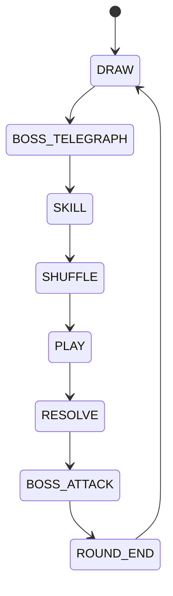
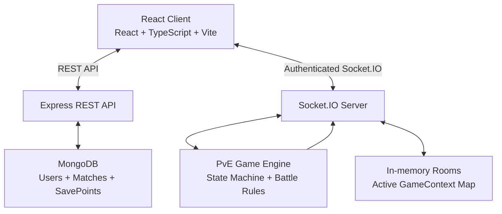

# Card Rogue

[中文](./README.md) | English

A full-stack browser PvE card battler built around poker-hand resolution. The React client owns interaction and presentation, while the Node.js server is authoritative for match state. Socket.IO drives real-time battle synchronization, and MongoDB persists accounts, match history, and rogue-mode saves.

## Live Demo

[https://card-rogue.onrender.com](https://card-rogue.onrender.com)

> The current project showcase link is deployed on Render. A first visit after idling may take 30–60 seconds to start.

## Project Highlights

- **Server-authoritative matches**: the client sends intent such as card selection, plays, and skill use; the server validates phase and input, computes the result, then synchronizes the full game state.
- **Explicit PvE state machine**: rounds advance through draw, boss telegraph, skill, shuffle, play, resolve, boss attack, and round end, without asking the client to infer rules.
- **Real-time bidirectional sync**: Socket.IO connections are JWT-protected; each user receives an isolated game room, and the server emits `gameState`, outcome, or error events after handling actions.
- **Persistent progress**: MongoDB stores users, completed matches, and rogue checkpoints; memory is used only for active battle rooms.
- **Complete browser experience**: registration/login, Google sign-in, avatar upload, lobby, recent matches, leaderboard, standard PvE and rogue mode, plus in-game audio and responsive UI.

## Features

- Poker-hand-driven play and damage resolution with up to five selected hand cards.
- Boss intent telegraphs, attacks, charge, and defense; boss configuration changes HP, attack, and intent weights by layer.
- Shield, change-color, and change-rank skills with energy, cooldown, and target validation.
- Standard PvE and a rogue progression loop with between-layer upgrades, stacked buffs, checkpoint save, and restore.
- Email/password registration and login, Google Identity Services sign-in, JWT Bearer authentication, and protected routes.
- User profile, avatar upload, recent matches, win-rate/win-count rankings, and XP display.

## Gameplay

After the player enters a standard PvE or rogue match, the server creates a room and initializes the deck, hand, boss, and first-round intent. A round follows this sequence:

```text
Draw → Boss telegraph → Use skills → Optional shuffle → Select cards → Confirm play
→ Evaluate hand/damage → Boss attack → Round end → Next round
```

The server resolves a play from poker hand type, card value, multiplier, buffs, and the boss defense state. Standard PvE outcomes are archived as match history; clearing a rogue layer moves the player to upgrade selection and saves a checkpoint before the next layer.

### PvE Round State Machine



## System Architecture



The current project has **no Redis dependency, connection configuration, or key logic**. Active matches live in server memory; MongoDB provides cross-session persistence.

## Tech Stack

| Category | Technology and responsibility |
| --- | --- |
| Frontend | React 19, TypeScript, Vite, React Router, Axios, Tailwind CSS; pages, interaction, REST calls, and the Socket client. |
| Backend | Node.js, Express 4, TypeScript; authentication, user, match, leaderboard, and rogue-save REST APIs. |
| Realtime | Socket.IO 4; authenticated PvE event handling and server-state synchronization. |
| Data | MongoDB and Mongoose; `User`, `Match`, and `SavePoint` documents. Active matches remain in memory. |
| Auth | JWT, bcrypt, Google Auth Library / Google Identity Services. |
| Tooling | npm workspaces, ESLint, Playwright (screenshot/browser helper scripts), PostCSS. |

## Core Technical Implementation

### Server-authoritative state and Socket.IO

Socket connections are authenticated through JWT middleware. The server derives a PvE room ID from the user ID and holds its `GameContext` in memory; client events such as `selectCard`, `confirmPlay`, `useSkill`, and `enterShuffle` express intent only. Event handlers validate the room, phase, and arguments, update the context, emit `gameState`, and emit `battleWin`, `battleLose`, or `gameError` when applicable.

### PvE state machine, cards, and combat

`backend/src/pve/` separates deck management, hand detection, boss behavior, damage calculation, round state, and action handling. After a play is confirmed, the server evaluates the poker hand, combines card value, hand multiplier, and buffs, and applies boss defense reduction. The boss attack is resolved and the next round advances only after the attack-animation completion event.

### MongoDB persistence

Completed standard PvE matches are written to `Match`, followed by an atomic update of the player's total games, wins, win rate, and maximum damage. Rogue mode uses `SavePoint` per user for its current snapshot, continuing a run, restoring a between-layer checkpoint, or deletion when a run is abandoned.

### Authentication

Local login validates passwords with bcrypt; Google login verifies a Google ID Token on the server. Both flows issue a seven-day JWT, and protected REST routes and Socket connections recover user identity from the Bearer Token.

## Project Structure

```text
CardGame/
├── frontend/
│   ├── public/                 # Cards, audio, images, videos, and other static assets
│   ├── scripts/                # Playwright screenshot and browser helper scripts
│   └── src/
│       ├── api/                # REST client modules
│       ├── components/         # Auth, common, game, lobby, and layout components
│       ├── hooks/              # Custom hooks, including game audio
│       ├── pages/              # Home, auth, lobby, game, and leaderboard pages
│       ├── socket/             # Socket.IO client creation
│       ├── stores/             # AuthContext and local auth state
│       └── utils/              # Audio and presentation helpers
├── backend/
│   └── src/
│       ├── config/             # MongoDB and CORS configuration
│       ├── controllers/        # REST controllers
│       ├── middleware/         # JWT, error handling, and avatar upload
│       ├── models/             # User, Match, and SavePoint Mongoose models
│       ├── pve/                # State machine, deck, boss, damage, and tests
│       ├── routes/             # REST routes
│       ├── services/           # Match archival and rogue saves
│       ├── socket/             # Socket authentication and PvE handlers
│       └── types/              # Card, buff, boss, and game-state types
├── package.json                # npm workspaces and root scripts
├── README.md                   # Default Chinese documentation
└── README_EN.md                # English documentation
```

## Run Locally

### Prerequisites

- Node.js (a current LTS release is recommended)
- npm
- An accessible MongoDB instance (local or Atlas)

### Install and configure

```bash
git clone <repository-url>
cd CardGame
npm install

cp backend/.env.example backend/.env
cp frontend/.env.example frontend/.env
```

Set the MongoDB and JWT configuration in `backend/.env`. Google sign-in is optional; without the relevant client ID, the Google login endpoint reports that it is not configured.

### Start development

The development proxy in `frontend/vite.config.ts` targets `http://localhost:5001`, while the backend defaults to `5000` when `PORT` is absent. When using the default proxy locally, set `PORT=5001` in `backend/.env`:

```bash
# Terminal 1
npm run dev:backend

# Terminal 2
npm run dev:frontend
```

The frontend is served by Vite; the backend health endpoint is `GET /api/health`.

### Production build and start

```bash
npm run build
npm run start -w backend
```

The root build runs frontend `tsc -b && vite build` followed by backend `tsc`. Frontend output is written to `frontend/dist/` and must be served by a static host.

## Environment Variables

### Backend: `backend/.env`

| Variable | Purpose |
| --- | --- |
| `PORT` | HTTP server port; the backend defaults to `5000` when unset. |
| `MONGODB_URI` | MongoDB connection address. |
| `JWT_SECRET` | Secret used to sign and verify JWTs. |
| `GOOGLE_CLIENT_ID` | Client ID used by the server to verify Google ID Tokens. |
| `FRONTEND_URL` | Frontend origin allowed by CORS. |

### Frontend: `frontend/.env`

| Variable | Purpose |
| --- | --- |
| `VITE_API_BASE_URL` | Production REST API base URL; leave blank locally to use the `/api` proxy. |
| `VITE_SOCKET_URL` | Production Socket.IO server URL; leave blank locally to use the same-origin proxy. |
| `VITE_API_ORIGIN` | Backend origin used when building uploaded-avatar URLs. |
| `VITE_GOOGLE_CLIENT_ID` | Web Client ID used by Google Identity Services. |

Commit only the `.env.example` templates. Do not commit secrets, tokens, passwords, or connection strings.

## Testing and Quality Checks

The project provides these scripts:

```bash
# Frontend ESLint
npm run lint -w frontend

# Frontend and backend production builds (including TypeScript compilation)
npm run build

# Backend PvE unit and integration tests
npm run test:pve -w backend
```

`backend/package.json` also exposes focused targets such as `test:handEvaluator`, `test:actions`, `test:roundLoop`, and `test:bossIntent`. This README lists available commands only and does not claim they are all currently passing.

## Deployment

The Render showcase URL provided by the existing README appears in “Live Demo.” The repository currently has no `render.yaml`, Dockerfile, Docker Compose file, or other infrastructure declaration, so it makes no additional claim about an unconfigured automated deployment flow.

For a manual deployment: build and host `frontend/dist/`, run backend `dist/index.js`, provide backend environment variables and reachable MongoDB, then point `VITE_API_BASE_URL`, `VITE_SOCKET_URL`, and `VITE_API_ORIGIN` to the deployed backend. There is no Redis deployment step.

## Screenshots

### Home


### Login


### Lobby


### Game


### Leaderboard


## License

The repository currently contains no License file. Confirm licensing terms with the project maintainer before reuse, distribution, or deployment.
